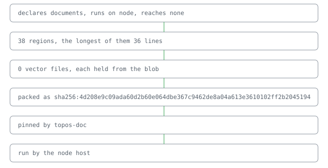

# @lapxo/topos-doc

     

Every page of a place, written from its lines.

A world for pages. Point it at a place, and it writes the README, the reference, the figures, the citation and the guide that place is read through, each page the regions a view names, each word a line and each number a receipt. [its regions, read off its own descriptor](docs/reference.md)

## Why pages are lines

A page written by hand drifts from what it describes. Here a page is only the regions its view names, read from signed lines and receipts, so a page moves only when a line does, and the line says who moved it.

## A README from five lines

## What it claims

- **It costs 2 dependencies: the algebra its cells are read by and the SDK it answers through.** · [receipt](receipts.bound)

It rests on topos.

## Check

● 0 cases hold

● `npm ci && npm run build`

## Pointers

- [Reference](docs/reference.md)
